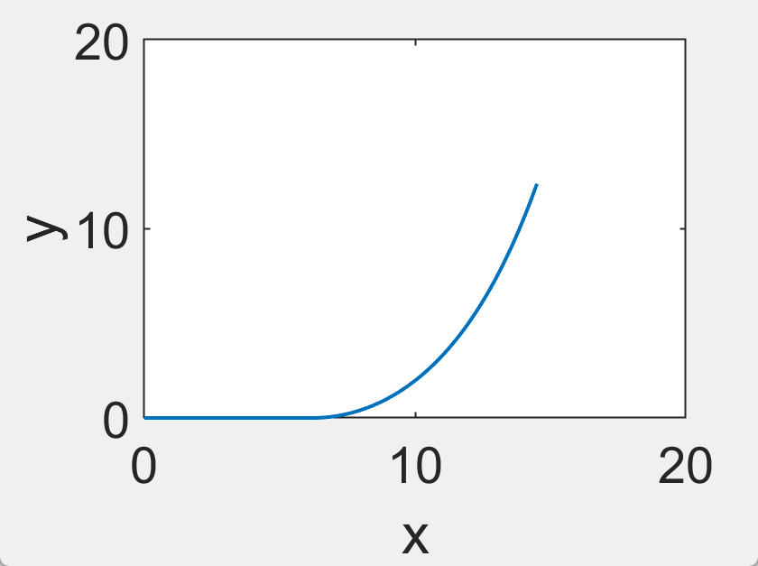
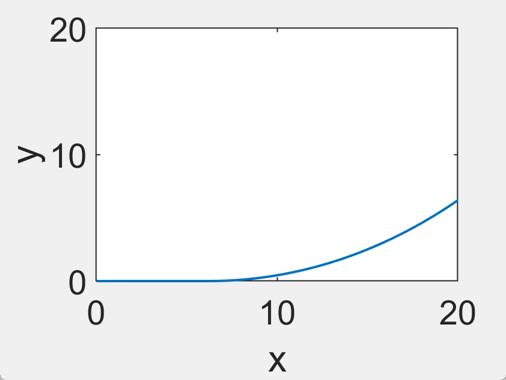

# 作业一

## 第一问

### 1.问题假设

**1.**假设所有物体表面形状、材料和表面细节分布均一致

**2.**海面无风浪波动

**3**.风力对浮标无起伏不会出现倾斜

**4.**风流速均匀

### 2.问题分析

### 受力分析

#### 1.浮标

使用隔离法对浮标进行受力分析

!

风阻系数为Cd。

风阻力：

圆柱的风阻力由风阻系数$Cd$和实质比面积$Ae$确定，风阻力的计算公式如下：
$$
F_{风} =Cd * Ae * 1/2 * ρ * V^2
$$
假设风速为 $ v $ 米/秒，空气密度为 1.225 kg/m³，圆柱体直径为 2 米，风阻系数为 $ C_d $为0.82，实质比面积 $ A_e $ 实际上就是迎风面积 $ A $。
首先，迎风面积 $ A $：
$$
A = \pi \left( \frac{D}{2} \right){h}
$$
然后，使用计算作用力 $ F _风$：
$$
  F_风 = 0.5 \times \rho \times v^2 \times A \times C_d
$$
$$
F_风 = 0.6125 \times v^2\times A \times C_d
$$
所以，风对直径为 2 米的圆柱体的作用力 $ F $ 可以表示为：
$$
F_风 = 1.9346 \times v^2 \times C_d \, \text{N}
$$
那么对于浮标就有水平和竖直方向:
$$
\begin{aligned}&F_\text{风}-F_1\sin\theta_1=0\\&F_\text{浮}-G-F_1\cos\theta_1=0\end{aligned}
$$

$$
F_\text{浮}=4\rho g\pi\times (2-h)
$$

带入得:
$$
F_1 \sin \theta_1 = 0.50225 \times v^2 \times \pi
$$

$$
47.8455 \times \pi \times h_1 - G - F_1 \cos \theta_1 = 0
$$

#### 2.钢管


因为海水静止,在某一时刻,每一节钢管均收到浮力、重力，以及相邻钢管或相邻浮标、锚链在其几何形状两端中心施加的拉力。四力在竖直平面使得钢管处于静力平衡状态。对四段钢管中的任意一个分析如图

同样对于任意一个钢管受力平衡有
$$
\begin{aligned}&F_{2i}\sin\theta_{2i}-F_{2i+1}\sin\theta_{2i+1}=0\\&F_{i+1}\cos\theta_{2i+1}-F_{2i}\cos\theta_{2i}-F_{\text{浮}2i}-G_{2i}=0\end{aligned}
$$
其中这个$H_i$为:
$$
H_{2i}=l\cos\alpha_{2i}
$$
那么有$F_{i}$与$F_{i+1}$在沿着钢管中心轴线方向上:
$$
F_{2i}\times\frac{1}{2}l\times\sin(\alpha_{2i}-\theta_{2i})-F_{2i+1}\times\frac{1}{2}l\times\sin(\theta_{2i+1}-\alpha_{2i})=0
$$

#### 3.重物球

重物球的质量为1200kg,这里假设为铁球


$$
F_\text{浮}=\rho_\text{海水}{gV}\\
G=mg\\
m=\rho\cdot V\\
V=\frac43\pi R^2
$$
就有
$$
F_\text{浮}=\frac{\rho_\text{海水}}{\rho}\cdot G
$$

#### 4.钢桶

已知钢桶内含水声通讯设备，其长为 1m、外径为 30cm，总质量为 100kg。


$$
\begin{aligned}&F_{管}\sin\theta_{4}-F_{\text{链}}\sin\theta_{4}=0\\&F_{管}\cos\theta_{4}+F_{\text{浮桶}}+F_{\text{浮球}}-G_{\text{桶}}-G_{\text{球}}-F_{\text{链}}\cos\theta_{\text{4}}=0\end{aligned}
$$
假设倾斜角度为$α_{桶}$

对于偏移后轴线方向有:
$$
F_管\times\frac12\times\sin(\alpha_\text{4}-\theta_4)-F_\text{链}\times\frac12\times\sin\left(\theta_\text{4}-\alpha_\text{4}\right)=0
$$

#### 5.锚链

锚链中每个链环处于静止状态，水平方向和竖直方向上受力平衡，即
$$
F_{浮i}+F_{锚i-1}\cos\theta_{i}=G_{锚(i+1)}+F_{锚(i+1)}\cos\theta_{(i+1)}\\F_{i-1}\sin\theta_{i}=F_{5(i+1)}\sin\theta_{(i+1)}
$$
中心轴线力矩
$$
\frac{1}{2}F_{5i}h\sin\biggl[\alpha_{(5i+1)}-\theta_{i}\biggr]=\frac{1}{2}F_{(5i+1)}h\sin\biggl[\theta_{(5i+1)}-\alpha_{(5i+1)}\biggr]
$$
那么对于锚链整体:


$$

$$

#### 6.锚体

$$
F_{6}+F_5cos\theta{6}=G_{6}\\f=F_{5}\sin\theta_{6}
$$

### 传递关系

设系泊系统的垂直高度为$H$ , 浮标的垂直高度为$H_1$,钢管的垂直高度为$H_2$,钢桶的垂直高度为$H_3$,锚链的垂直高度为$H_5$,$H_0$为18
浮标的垂直高度$H_{_1}$即为浮标的吃水深度$h_1;$
钢管总数为 4,其垂直高度与自身的倾斜角度和长度$h_{_2}$有关，且每个钢管的倾斜角度不同，钢桶的总垂直高度计算公式为$$H_2=\sum_{i=1}^4h_2\cos\alpha_{2i}$$
钢桶的垂直高度与倾斜角度和长度$h_{_3}$有关，计算公式为$$H_3=h_3\cos\alpha_{31}$$

锚链由多个链环构成，单个链环的垂直高度与自身的倾斜角度和长度$h_{\mathrm{s}}$有关，且每个链环的倾斜角度不同，锚链的总垂直高度计算公式为
$$H_5=\sum_{i=1}^mh_5\cos\alpha_{5i},m\leq\frac{L}{h_5}$$

假定$2-H$为$h_{1}$,寻找系泊系统垂直高度$H$ 与水深$H_{0}$最小差值的绝对值，建立模型，$$\min\begin{vmatrix}H-H_0\end{vmatrix}$$

浮标在这段时间内以锚为圆心近趋于圆形游动。将浮标的游动区域转化为游动半径进行研究，游动半径为浮标与锚的水平距离。系统的水平距离由钢管、钢桶和锚链的水平距离构成。探究浮标的游动半径大小，设游动半径为$R$,钢管的水平距离为$X_{_2}$,钢桶的水平距离为$X_{_3}$,锚链的水平距离为$X_{_5}$,
钢管的数量为 4,钢管的水平距离与自身的倾斜角度和长度$h_{_2}$有关，且每个钢管的倾斜角度不同，钢管的水平总距离为每个钢管的水平距离累计和，计算公式为$$X_2=\sum_{i=1}^4h_2\sin\alpha_{2i}$$
钢桶的水平距离与倾斜角度和长度$h_{3}$有关，计算公式为$$X_3=h_3\sin\alpha_{31}$$
多个链环组成锚链，单个链环的水平距离与自身的倾斜角度和长度$h_{5}$有关，且每个链环的倾斜角度不同，考虑锚链可能会存在一部分沉在水底，一部分浮在
水中，则计算公式为
$$X_{5}=\sum_{i=1}^{p}h_{5}+\sum_{i=p+1}^{q}h_{5}\sin\alpha_{5i},p+q\leq\frac{L}{h_{5}}$$得到系泊系统的游动半径$R$为$$R=X_2+X_3+X_5$$

### 力的传递

利用浮标求解得到的张力$F_浮$与第 1 个钢管上端所受张力$F_{2\mathrm{l}}$大小相同，角度$\theta_1$与$\theta_{21}$相同，代入钢管的受力平衡方程组式和力矩平衡方程式，根据第 1 个钢管的受力分析表达式
$$
F_{2}+F_{21}\cos\theta_{21}=G_{2}+F_{22}\cos\theta_{22}\\F_{21}\sin\theta_{21}=F_{22}\sin\theta_{22}\\\frac{1}{2}F_{21}h_{2}\sin\left[\alpha_{22}-\theta_{21}\right]=\frac{1}{2}F_{22}h_{2}\sin\left[\theta_{22}-\alpha_{22}\right]
$$
同理传递至第二个钢管直至第四个

第 4 个钢管下端与钢桶上端相连，根据力的平衡条件，第 4 个钢管下端所受张力$F_{24}$和角度$\theta_{24}$与钢桶上端所受张力$F_3$和角度$\theta_{3}$大小相等，将其代入钢桶的受力分析式，得到钢桶下端张力$F_{3}$、角度$\theta_{3}$和钢桶自身角度$\alpha_{3}$

锚链的第 1 个链环上端与钢桶下端相连，根据力的平衡条件，钢桶下端张力$T_{32}$、角度$\theta_{32}$与第 1 个链环上端张力$T_\mathrm{\varsigma l}$、角度$\theta_{51}$大小相同，代入钢管的受力平衡方程组(26)式和力矩平衡方程式(27)式，根据第1个链环的受力分析表达式

$$
\\F_{5}+F_{51}\cos\theta_{51}=G_{5}+T_{52}\cos\theta_{52}\\F_{51}\sin\theta_{51}=F_{52}\sin\theta_{52}\\\frac{1}{2}F_{51}h_{5}\sin\left[\alpha_{52}-\theta_{51}\right]=\frac{1}{2}F_{52}h_{5}\sin\left[\theta_{52}-\alpha_{52}\right]
$$
同理经过传递得到第210个链环,最后一个也传递至锚体

### 3.模型求解

首先按步长0.1对浮标的吃水深度$h_\mathrm{i}$进行划分，利用程序循环遍历。根据建立的系统垂直高度模型，求解出系统中浮标、钢管、钢桶和锚链的垂直高度，寻找水深为18m时，系泊系统的高度$H$与水深$H_{0}$最小差值绝对值。结果得到浮标的出水深度在 0.6~0.7m 内，符合纵向约束条件。接着按步长 0.01 进行划分，结果得到浮标的吃水深度范围在 0.68~0.69m 之间。最后按步长 0.001 划分，结果得到浮标的吃水深度为 0.683m 时，系泊系统的高度与水深差值的绝对值最小。


v=12

| 钢管角度 | 钢桶角度 | 浮标吃水深度 | 浮标游动半径 | 锚链末端夹角 | 链结漂浮个数 | 系统总高度 |
| -------- | -------- | ------------ | ------------ | ------------ | ------------ | ---------- |
| 1.1585   | 1.2004   | 0.6830       | 14.6036      | 0            | 152          | 18.0628    |
| 1.1663   |          |              |              |              |              |            |
| 1.1742   |          |              |              |              |              |            |
| 1.1822   |          |              |              |              |              |            |



v=24



| 钢管角度 | 钢桶角度 | 浮标吃水深度 | 浮标游动半径 | 锚链末端夹角 | 链结漂浮个数 | 系统总高度 |
| -------- | -------- | ------------ | ------------ | ------------ | ------------ | ---------- |
| 4.6245   | 4.7910   | 0.6830       | 20.5818      | 0            | 152          | 12.2297    |
| 4.6555   |          |              |              |              |              |            |
| 4.6868   |          |              |              |              |              |            |
| 4.7187   |          |              |              |              |              |            |

```matlab
%% 浮标1
g=9.807;%重力加速度
p=1025;%海水密度
m1=1000;%浮标质量
v=12;%海面风速
 
count0=0;
HH=zeros(10,1);
for h1=0.50:0.01:0.75 %吃水深度（遍历寻找最优解）
count0=count0+1;%循环计数
 
V1=pi*h1;%浮标吃水体积
syms fT1;%拉力T（下同）
syms fsi1;%角度SITA（下同）
 
G1=m1*g;
B1=p*g*V1;
Ffeng=0.625*((2-h1)*2)*v^2;
eq11=B1-G1-fT1*cosd(fsi1);
eq12=Ffeng-fT1*sind(fsi1);
[fT1,fsi1]=solve(eq11,eq12,fT1,fsi1);
index1=find(fT1>0);
T1=double(fT1(index1));
si1=double(fsi1(index1));
r1=0;%横坐标长度
 
%% 钢管2
m2=10;%每节钢管质量
V2=pi*0.025^2*1;%钢管体积
L2=1;
G2=m2*g;
B2=p*g*V2;
 
T2=zeros(5,1);
si2=zeros(5,1);
a2=zeros(4,1);
T2(1)=T1(1);si2(1)=si1(1);
for n=1:4
    si2(n+1)=atand((T2(n)*sind(si2(n)))/(T2(n)*cosd(si2(n))+B2-G2));
    T2(n+1)=(T2(n)*sind(si2(n)))/(sind(si2(n+1)));
    a2(n)=atand((T2(n+1)*sind(si2(n+1))+T2(n)*sind(si2(n)))/(T2(n)*cosd(si2(n))+T2(n+1)*cosd(si2(n+1))));
end
% for i=1:3
%     eq21=fT2(i)*cosd(fsi2(i))+B2-m2*g-fT2(i+1)*cosd(fsi2(i+1));%受力
%     eq22=fT2(i)*sind(fsi2(i))-fT2(i+1)*sind(fsi2(i+1));%受力
%     eq23=0.5*fT2(i)*L2*sind(fa2(i+1)-fsi2(i))-0.5*fT2(i+1)*L2*sind(fsi2(i+1)-fa2(i+1));%力矩
%     sol2=solve(eq21,eq22,eq23,fT2(i+1),fsi2(i+1),fa2(i+1));%解方程
%     sol2=struct2cell(sol2);%结构体转元胞数组
%     
%     index2=find(sol2{1,1}>0);%寻找大于0的解
%     T2(i+1)=double(sol2{1,1}(index2(1),1));%写入答案
%     si2(i+1)=double(sol2{2,1}(index2(1),1));
%     a2(i+1)=double(sol2{3,1}(index2(1),1))+180;
%     fT2(i+1)=T2(i+1);
%     fsi2(i+1)=si2(i+1);
%     fa2(i+1)=a2(i+1);
% end
h2=L2*cosd(a2);%高度
r2=abs(L2*sind(a2));%横坐标长度
 
%% 重物球4
m4=1200;%重物球质量
p4=7850;%钢的密度
V4=m4/p4;%重物球体积
G4=m4*g;
B4=p*g*V4;
T41=G4-B4;
 
%% 钢桶3
m3=100;%钢桶质量
V3=pi*0.15^2*1;%钢桶体积
L3=1;
G3=m3*g;
B3=p*g*V3;
 
T31=T2(5);%取第2段的值
si31=si2(5);
T32=sqrt((T31*cosd(si31)+B3-G3-T41)^2+(T31*sind(si31))^2);
si32=atand((T31*sind(si31))/(T31*cosd(si31)+B3-G3-T41));
syms fa3
eq3=0.5*T32*L3*sind(si32-fa3)-0.5*T41*L3*sind(fa3)-0.5*T31*L3*sind(fa3-si31);%力矩平衡
[fa3]=solve(eq3,fa3);%解方程
a3=double(fa3);
index3=find(a3>0);
a3=double(a3(index3));
 
h3=L3*cosd(a3);%高度
r3=abs(L3*sind(a3));%横坐标长度
 
%% 各锚链节5
L5=0.105;%单个锚链长度
m5=7*L5;%单个锚链质量
p5=7850;%钢的密度
V5=m5/p5;%单个锚链体积
G5=m5*g;
B5=p*g*V5;
 
T5=zeros(211,1);
si5=zeros(211,1);
a5=zeros(211,1);
h5=zeros(211,1);
T5(1)=T32;si5(1)=si32;%取第3段的值
a5(1)=si32;
for i=1:210
    si5(i+1)=atand((T5(i)*sind(si5(i)))/(T5(i)*cosd(si5(i))+B5-G5));
    T5(i+1)=sqrt((T5(i)*cosd(si5(i))+B5-G5)^2+(T5(i)*sind(si5(i)))^2);
    a5(i+1)=atand((T5(i+1)*sind(si5(i+1))+T5(i)*sind(si5(i)))/(T5(i)*cosd(si5(i))+T5(i+1)*cosd(si5(i+1))));
    if si5(i+1)<0
        abs(si5(i+1));
    end
    if abs(a5(i+1))<1
       a5(i+1)=90;
    end
end
%% 绘图6
x=zeros(211,1);
y=zeros(211,1);
x(1)=0;
y(1)=0;
count=211;
count00=0;%链接漂浮个数
for ii=1:210
    if a5(count)==0
       a5(count)=90;
    end
    x(ii+1)=x(ii)+L5*sind(a5(count));
    y(ii+1)=y(ii)+L5*cosd(a5(count));
    count=count-1;
    if a5(ii)~=90
        count00=count00+1;
    end
end
H=h1+sum(h2)+h3+y(211,1);%总高度
r0=r1+sum(r2)+r3+x(211,1);%游动半径
HH(count0)=H;
end
% plot(x,y,'linewidth',2)
% axis([0 20 0 20])
% xlabel('x','FontSize',28);
% ylabel('y','FontSize',28);
% set(gca,'FontSize',28,'linewidth',1);
```

```matlab
%% 浮标1
g=9.807;%重力加速度
p=1025;%海水密度
m1=1000;%浮标质量
v=12;%海面风速
 
count0=0;
HH=zeros(10,1);
for h1=0.680:0.001:0.690 %吃水深度（遍历寻找最优解）
count0=count0+1;%循环计数
 
V1=pi*h1;%浮标吃水体积
syms fT1;%拉力T（下同）
syms fsi1;%角度SITA（下同）
 
G1=m1*g;
B1=p*g*V1;
Ffeng=0.625*((2-h1)*2)*v^2;
eq11=B1-G1-fT1*cosd(fsi1);
eq12=Ffeng-fT1*sind(fsi1);
[fT1,fsi1]=solve(eq11,eq12,fT1,fsi1);
index1=find(fT1>0);
T1=double(fT1(index1));
si1=double(fsi1(index1));
r1=0;%横坐标长度
 
%% 钢管2
m2=10;%每节钢管质量
V2=pi*0.025^2*1;%钢管体积
L2=1;
G2=m2*g;
B2=p*g*V2;
 
T2=zeros(5,1);
si2=zeros(5,1);
a2=zeros(4,1);
T2(1)=T1(1);si2(1)=si1(1);
for n=1:4
    si2(n+1)=atand((T2(n)*sind(si2(n)))/(T2(n)*cosd(si2(n))+B2-G2));
    T2(n+1)=(T2(n)*sind(si2(n)))/(sind(si2(n+1)));
    a2(n)=atand((T2(n+1)*sind(si2(n+1))+T2(n)*sind(si2(n)))/(T2(n)*cosd(si2(n))+T2(n+1)*cosd(si2(n+1))));
end
% for i=1:3
%     eq21=fT2(i)*cosd(fsi2(i))+B2-m2*g-fT2(i+1)*cosd(fsi2(i+1));%受力
%     eq22=fT2(i)*sind(fsi2(i))-fT2(i+1)*sind(fsi2(i+1));%受力
%     eq23=0.5*fT2(i)*L2*sind(fa2(i+1)-fsi2(i))-0.5*fT2(i+1)*L2*sind(fsi2(i+1)-fa2(i+1));%力矩
%     sol2=solve(eq21,eq22,eq23,fT2(i+1),fsi2(i+1),fa2(i+1));%解方程
%     sol2=struct2cell(sol2);%结构体转元胞数组
%     
%     index2=find(sol2{1,1}>0);%寻找大于0的解
%     T2(i+1)=double(sol2{1,1}(index2(1),1));%写入答案
%     si2(i+1)=double(sol2{2,1}(index2(1),1));
%     a2(i+1)=double(sol2{3,1}(index2(1),1))+180;
%     fT2(i+1)=T2(i+1);
%     fsi2(i+1)=si2(i+1);
%     fa2(i+1)=a2(i+1);
% end
h2=L2*cosd(a2);%高度
r2=abs(L2*sind(a2));%横坐标长度
 
%% 重物球4
m4=1200;%重物球质量
p4=7850;%钢的密度
V4=m4/p4;%重物球体积
G4=m4*g;
B4=p*g*V4;
T41=G4-B4;
 
%% 钢桶3
m3=100;%钢桶质量
V3=pi*0.15^2*1;%钢桶体积
L3=1;
G3=m3*g;
B3=p*g*V3;
 
T31=T2(5);%取第2段的值
si31=si2(5);
T32=sqrt((T31*cosd(si31)+B3-G3-T41)^2+(T31*sind(si31))^2);
si32=atand((T31*sind(si31))/(T31*cosd(si31)+B3-G3-T41));
syms fa3
eq3=0.5*T32*L3*sind(si32-fa3)-0.5*T41*L3*sind(fa3)-0.5*T31*L3*sind(fa3-si31);%力矩平衡
[fa3]=solve(eq3,fa3);%解方程
a3=double(fa3);
index3=find(a3>0);
a3=double(a3(index3));
 
h3=L3*cosd(a3);%高度
r3=abs(L3*sind(a3));%横坐标长度
 
%% 各锚链节5
L5=0.105;%单个锚链长度
m5=7*L5;%单个锚链质量
p5=7850;%钢的密度
V5=m5/p5;%单个锚链体积
G5=m5*g;
B5=p*g*V5;
 
T5=zeros(211,1);
si5=zeros(211,1);
a5=zeros(211,1);
h5=zeros(211,1);
T5(1)=T32;si5(1)=si32;%取第3段的值
a5(1)=si32;
for i=1:210
    si5(i+1)=atand((T5(i)*sind(si5(i)))/(T5(i)*cosd(si5(i))+B5-G5));
    T5(i+1)=sqrt((T5(i)*cosd(si5(i))+B5-G5)^2+(T5(i)*sind(si5(i)))^2);
    a5(i+1)=atand((T5(i+1)*sind(si5(i+1))+T5(i)*sind(si5(i)))/(T5(i)*cosd(si5(i))+T5(i+1)*cosd(si5(i+1))));
    if si5(i+1)<0
        abs(si5(i+1));
    end
    if abs(a5(i+1))<1
       a5(i+1)=90;
    end
end
%% 绘图6
x=zeros(211,1);
y=zeros(211,1);
x(1)=0;
y(1)=0;
count=211;
count00=0;%链接漂浮个数
for ii=1:210
    if a5(count)==0
       a5(count)=90;
    end
    x(ii+1)=x(ii)+L5*sind(a5(count));
    y(ii+1)=y(ii)+L5*cosd(a5(count));
    count=count-1;
    if a5(ii)~=90
        count00=count00+1;
    end
end
H=h1+sum(h2)+h3+y(211,1);%总高度
r0=r1+sum(r2)+r3+x(211,1);%游动半径
HH(count0)=H;
end
% plot(x,y,'linewidth',2)
% axis([0 20 0 20])
% xlabel('x','FontSize',28);
% ylabel('y','FontSize',28);
% set(gca,'FontSize',28,'linewidth',1);
```


```matlab
%% 浮标1
g=9.807;%重力加速度
p=1025;%海水密度
m1=1000;%浮标质量
v=12;%海面风速
 
h1=0.683;%吃水深度
 
V1=pi*h1;%浮标吃水体积
syms fT1;%拉力T（下同）
syms fsi1;%角度SITA（下同）
 
G1=m1*g;
B1=p*g*V1;
Ffeng=0.625*((2-h1)*2)*v^2;
eq11=B1-G1-fT1*cosd(fsi1);
eq12=Ffeng-fT1*sind(fsi1);
[fT1,fsi1]=solve(eq11,eq12,fT1,fsi1);
index1=find(fT1>0);
T1=double(fT1(index1));
si1=double(fsi1(index1));
r1=0;%横坐标长度
 
%% 钢管2
m2=10;%每节钢管质量
V2=pi*0.025^2*1;%钢管体积
L2=1;
G2=m2*g;
B2=p*g*V2;
 
T2=zeros(5,1);
si2=zeros(5,1);
a2=zeros(4,1);
T2(1)=T1(1);si2(1)=si1(1);
for n=1:4
    si2(n+1)=atand((T2(n)*sind(si2(n)))/(T2(n)*cosd(si2(n))+B2-G2));
    T2(n+1)=(T2(n)*sind(si2(n)))/(sind(si2(n+1)));
    a2(n)=atand((T2(n+1)*sind(si2(n+1))+T2(n)*sind(si2(n)))/(T2(n)*cosd(si2(n))+T2(n+1)*cosd(si2(n+1))));
end

h2=L2*cosd(a2);%高度
r2=abs(L2*sind(a2));%横坐标长度
 
%% 重物球4
m4=1200;%重物球质量
p4=7850;%钢的密度
V4=m4/p4;%重物球体积
G4=m4*g;
B4=p*g*V4;
T41=G4-B4;
 
%% 钢桶3
m3=100;%钢桶质量
V3=pi*0.15^2*1;%钢桶体积
L3=1;
G3=m3*g;
B3=p*g*V3;
 
T31=T2(5);%取第2段的值
si31=si2(5);
T32=sqrt((T31*cosd(si31)+B3-G3-T41)^2+(T31*sind(si31))^2);
si32=atand((T31*sind(si31))/(T31*cosd(si31)+B3-G3-T41));
syms fa3
eq3=0.5*T32*L3*sind(si32-fa3)-0.5*T41*L3*sind(fa3)-0.5*T31*L3*sind(fa3-si31);%力矩平衡
[fa3]=solve(eq3,fa3);%解方程
a3=double(fa3);
index3=find(a3>0);
a3=double(a3(index3));
 
h3=L3*cosd(a3);%高度
r3=abs(L3*sind(a3));%横坐标长度
 
%% 各锚链节5
L5=0.105;%单个锚链长度
m5=7*L5;%单个锚链质量
p5=7850;%钢的密度
V5=m5/p5;%单个锚链体积
G5=m5*g;
B5=p*g*V5;
 
T5=zeros(211,1);
si5=zeros(211,1);
a5=zeros(211,1);
h5=zeros(211,1);
T5(1)=T32;si5(1)=si32;%取第3段的值
a5(1)=si32;
for i=1:210
    si5(i+1)=atand((T5(i)*sind(si5(i)))/(T5(i)*cosd(si5(i))+B5-G5));
    T5(i+1)=sqrt((T5(i)*cosd(si5(i))+B5-G5)^2+(T5(i)*sind(si5(i)))^2);
    a5(i+1)=atand((T5(i+1)*sind(si5(i+1))+T5(i)*sind(si5(i)))/(T5(i)*cosd(si5(i))+T5(i+1)*cosd(si5(i+1))));
    if si5(i+1)<0
        abs(si5(i+1));
    end
    if abs(a5(i+1))<1
       a5(i+1)=90;
    end
end
%% 绘图6
x=zeros(211,1);
y=zeros(211,1);
x(1)=0;
y(1)=0;
count=211;
count00=0;%链接漂浮个数
for ii=1:210
    if a5(count)==0
       a5(count)=90;
    end
    x(ii+1)=x(ii)+L5*sind(a5(count));
    y(ii+1)=y(ii)+L5*cosd(a5(count));
    count=count-1;
    if a5(ii)~=90
        count00=count00+1;
    end
end
H=h1+sum(h2)+h3+y(211,1);%总高度
r0=r1+sum(r2)+r3+x(211,1);%游动半径
plot(x,y,'linewidth',2)
axis([0 20 0 20])
xlabel('x','FontSize',28);
ylabel('y','FontSize',28);
set(gca,'FontSize',28,'linewidth',1);
 
%% 导出数据7
filterName=["钢管角度","钢桶角度","浮标吃水深度","浮标游动半径","锚链末端夹角","链结漂浮个数","系统总高度"];
xlswrite('problem1.xlsx',filterName,'v=12','A1');
xlswrite('problem1.xlsx',a2,'v=12','A2');
xlswrite('problem1.xlsx',a3,'v=12','B2');
xlswrite('problem1.xlsx',h1,'v=12','C2');
xlswrite('problem1.xlsx',r0,'v=12','D2');
xlswrite('problem1.xlsx',90-a5(210),'v=12','E2');
xlswrite('problem1.xlsx',count00,'v=12','F2');
xlswrite('problem1.xlsx',H,'v=12','G2');
```

